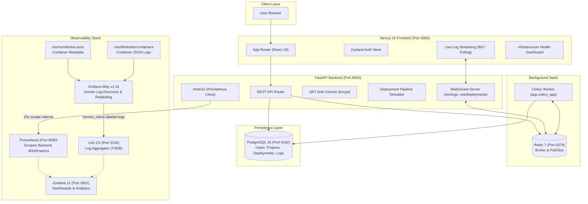

# StackForge ⚡

> **Production-Grade Cloud-Native Internal Developer Platform (IDP)**  
> Inspired by modern DevOps control planes like Portainer, Harness, and GitLab. Built to orchestrate multi-project lifecycles, continuous deployment pipelines, live container log streaming, and deep infrastructure observability.

---


---

## 📌 Executive Summary & Current Status

StackForge provides engineering teams with a single pane of glass for managing microservices, executing verifiable multi-stage deployment workflows, inspecting container health in real-time, and diagnosing logs across a unified cloud-native ecosystem.

### Current Implementation State:
- **Phase 1 (Foundation):** ✅ **100% Complete** — Repository scaffold, Docker networks, PostgreSQL & Redis topology, Alembic database migrations.
- **Phase 2 (Authentication):** ✅ **100% Complete** — Full JWT authentication with bcrypt hashing, `/auth/register`, `/auth/login`, `/auth/me`, Zustand persistent auth store, and Next.js route protection.
- **Phase 3 (Platform Core & Observability):**
  - **Milestone 5 (Dashboard API):** ✅ **Complete** — Live KPIs, real-time activity feed, deployment metrics.
  - **Milestone 6 (Projects Management):** ✅ **Complete** — Full CRUD, project detail views, tech stack catalog, health metrics.
  - **Milestone 7 (Deployments Pipeline):** ✅ **Complete** — 6-stage deployment execution (`Source → Build → Test → Security Scan → Deploy → Verify`), PostgreSQL persistence, duration calculation, and failure/success recovery.
  - **Milestone 8 (Monitoring, Logs & Observability):** ✅ **Complete** — Full 4-component observability stack:
    - **Prometheus (v3.5.0):** Live scraping of FastAPI `/metrics` every 15s.
    - **Grafana (12.1.1):** Operational at `http://localhost:3001`.
    - **Loki (3.5.0):** Operational at `http://localhost:3100` with TSDB schema.
    - **Grafana Alloy (v1.10.2):** Automatic Docker container discovery via `/var/run/docker.sock`, dynamic Compose relabeling (`service_name`), and high-performance log forwarding.
    - **In-App Telemetry & Logs:** WebSocket log streaming (`/ws/logs/{deployment_id}`), live server health, and 24h CPU/RAM/Disk metrics.
- **Phase 4 (DevOps Infrastructure):** ⏳ **Next Milestone** — Kubernetes manifests, Terraform IaC, GitHub Actions CI/CD, and Argo CD GitOps integration.

---

## 🏗️ System Architecture



---

## 📦 Container Services & Port Allocation

All 9 services run orchestrated within the isolated bridge network `stackforge-net`:

| Service Name | Container Name | Technology | Host Port | Internal Port | Health / Status |
|---|---|---|---|---|---|
| **frontend** | `stackforge-frontend` | Next.js 16 / React 19 | `3000` | `3000` | ✅ Healthy |
| **backend** | `stackforge-backend` | FastAPI / Python 3.12 | `8000` | `8000` | ✅ Healthy |
| **db** | `stackforge-db` | PostgreSQL 16 Alpine | `5432` | `5432` | ✅ Healthy (`pg_isready`) |
| **redis** | `stackforge-redis` | Redis 7 Alpine | `6379` | `6379` | ✅ Healthy (`redis-cli ping`) |
| **worker** | `stackforge-worker` | Celery 5.4 / Python | — | — | ✅ Running (Async Tasks) |
| **prometheus** | `stackforge-prometheus` | Prometheus v3.5.0 | `9090` | `9090` | ✅ Running (`/metrics` scrape up) |
| **grafana** | `stackforge-grafana` | Grafana 12.1.1 | `3001` | `3000` | ✅ Running |
| **loki** | `stackforge-loki` | Grafana Loki 3.5.0 | `3100` | `3100` | ✅ Running (TSDB schema) |
| **alloy** | `stackforge-alloy` | Grafana Alloy v1.10.2 | — | `12345` | ✅ Running (Collecting 9 services) |

---

## 🚀 Key Platform Features

### 1. Unified Project Management
- Interactive project catalog with dynamic health scores, tech stack tags, and repository links.
- Full CRUD operations connected to PostgreSQL via SQLAlchemy models.
- Direct association with deployment histories and infrastructure statuses.

### 2. Multi-Stage Deployment Pipelines
- Visual pipeline runner displaying 6 continuous delivery stages:
  $$\text{Source} \longrightarrow \text{Build} \longrightarrow \text{Test} \longrightarrow \text{Security Scan} \longrightarrow \text{Deploy} \longrightarrow \text{Verify}$$
- Real-time execution tracking backed by Redis Pub/Sub and Celery worker.
- Persistent execution records stored with exact start/completion timestamps and duration tracking.

### 3. Real-Time Log Streaming
- In-browser streaming log terminal supporting ANSI color formatting, timestamping, and service-based filtering.
- Two-way communication over WebSocket endpoints:
  - `/api/v1/ws/logs/{deployment_id}`: Live deployment stdout/stderr stream.
  - `/api/v1/ws/deployments/{deployment_id}/status`: Live stage transition updates.
- Automatic polling fallback mechanism for environments where WebSockets are restricted.

### 4. Infrastructure & Server Telemetry
- Interactive infrastructure monitor (`/dashboard/infrastructure`):
  - Total servers, healthy nodes, and active warning alerts.
  - 24-hour cluster CPU utilization chart.
  - 24-hour memory utilization chart.
  - Disk storage utilization chart.
  - 30-day Uptime SLA tracking per instance.

### 5. Production Observability Stack (Prometheus + Grafana + Loki + Alloy)
- **Zero-touch Container Log Discovery:** Grafana Alloy dynamically queries `/var/run/docker.sock` to detect containers.
- **Dynamic Compose Service Relabeling:** Container ID and compose service label (`__meta_docker_container_label_com_docker_compose_service`) are automatically resolved into clean `service_name` labels.
- **Verified Loki Ingestion:** All 9 platform containers are dynamically indexed in Loki:
  `["alloy", "backend", "db", "frontend", "grafana", "loki", "prometheus", "redis", "worker"]`
- **Application Metrics Scraping:** Prometheus scrapes FastAPI `/metrics` at 15-second intervals; application health status verified as `UP`.

---

## 🛠️ Tech Stack & Technologies

### Frontend
- **Framework:** Next.js 16 (App Router)
- **UI & State:** React 19, TypeScript, Tailwind CSS v4, Zustand
- **Animations & Visuals:** Framer Motion, Lucide React, Recharts
- **Components:** Radix UI / Shadcn primitives

### Backend
- **Framework:** FastAPI 0.115
- **ORM & Migrations:** SQLAlchemy 2.0, Alembic 1.14
- **Security:** JWT (python-jose), Bcrypt (passlib)
- **Asynchronous Processing:** Celery 5.4, Redis 7 (Pub/Sub + Task Broker)
- **Telemetry:** Prometheus Client 0.21, Structlog 24.4

### Monitoring & Infrastructure
- **Containerization:** Docker & Docker Compose
- **Metrics Storage:** Prometheus v3.5.0
- **Log Aggregator:** Grafana Loki 3.5.0
- **Telemetry Collector:** Grafana Alloy v1.10.2
- **Visualization:** Grafana 12.1.1

---

## 🚦 Quick Start Guide

### Prerequisites
- Docker Engine $\ge 24.0$
- Docker Compose $\ge v2.20$
- Node.js $\ge 20$ (for local frontend development without Docker)
- Python $\ge 3.12$ (for local backend development without Docker)

### 1. Clone & Configure Environment
```bash
git clone https://github.com/satviashwin369-creator/StackForge.git
cd StackForge

# Copy environment template if not present
cp .env.example .env
```

### 2. Start Full Stack with Docker Compose
```bash
# Build and launch all 9 services in background
docker compose up -d --build
```

### 3. Verify Container Status
```bash
docker compose ps
```
All containers (`frontend`, `backend`, `db`, `redis`, `worker`, `prometheus`, `grafana`, `loki`, `alloy`) should be in `Up` or `healthy` state.

### 4. Access Platform Portals
| Portal | URL | Credentials / Notes |
|---|---|---|
| **StackForge Web Dashboard** | `http://localhost:3000` | Create account via Signup or use seeded demo |
| **FastAPI Interactive Swagger** | `http://localhost:8000/docs` | Full OpenAPI specification |
| **Backend Health Endpoint** | `http://localhost:8000/health` | Returns `{"status": "ok"}` |
| **Prometheus Metrics** | `http://localhost:8000/metrics` | Raw Prometheus exposition format |
| **Prometheus Dashboard** | `http://localhost:9090` | Targets status: `http://localhost:9090/targets` |
| **Grafana UI** | `http://localhost:3001` | Default: `admin` / `admin` |
| **Loki API** | `http://localhost:3100` | Log labels: `/loki/api/v1/label/service_name/values` |

---

## 🔌 API Endpoint Directory

### Authentication (`/api/v1/auth`)
- `POST /api/v1/auth/register` — Create new user account
- `POST /api/v1/auth/login` — Authenticate and receive JWT Bearer token
- `GET /api/v1/auth/me` — Retrieve profile for current authenticated user

### Projects (`/api/v1/projects`)
- `GET /api/v1/projects` — List all user projects with health indicators
- `POST /api/v1/projects` — Create new project
- `GET /api/v1/projects/{id}` — Get project details by ID
- `PUT /api/v1/projects/{id}` — Update project metadata
- `DELETE /api/v1/projects/{id}` — Delete project

### Deployments (`/api/v1/deployments`)
- `GET /api/v1/deployments` — List deployment history
- `POST /api/v1/deployments` — Trigger new deployment pipeline
- `GET /api/v1/deployments/{id}` — Retrieve deployment run details and status
- `GET /api/v1/deployments/project/{project_id}` — List deployments for a specific project
- `GET /api/v1/deployments/{id}/pipeline` — Retrieve active 6-stage pipeline progress

### Logs & WebSockets (`/api/v1/logs`, `/api/v1/ws`)
- `GET /api/v1/logs/recent` — Fetch recent cross-service logs
- `GET /api/v1/logs/deployment/{deployment_id}` — Fetch logs for specific deployment
- `WS /api/v1/ws/logs/{deployment_id}` — WebSocket stream of real-time deployment logs
- `WS /api/v1/ws/deployments/{deployment_id}/status` — WebSocket stream of deployment state transitions

### Infrastructure & Analytics (`/api/v1/infra`, `/api/v1/dashboard`)
- `GET /api/v1/infra/status` — Cluster and node health statuses
- `GET /api/v1/infra/metrics` — Aggregate CPU, Memory, Disk timeseries
- `GET /api/v1/infra/kpis` — High-level platform KPIs
- `GET /api/v1/infra/activities` — Recent system event feed

---

## 📈 Roadmap & Upcoming Milestones

- [x] **Milestone 1–4:** Frontend & Backend Authentication, Session Persistence, Route Guards
- [x] **Milestone 5:** Live Dashboard APIs & Real-Time Metrics
- [x] **Milestone 6:** Project Management with PostgreSQL Persistence
- [x] **Milestone 7:** 6-Stage Deployment Pipeline & Execution Visualization
- [x] **Milestone 8:** Full Observability Stack (Prometheus, Grafana, Loki, Grafana Alloy dynamic Docker labeling)
- [ ] **Milestone 9:** DevOps Infrastructure & Production Deployment
  - [ ] Kubernetes Manifests (Deployments, StatefulSets, Services, Ingress)
  - [ ] Terraform Modules for AWS/Cloud Provisioning
  - [ ] GitHub Actions Automated Testing & Image Publishing CI
  - [ ] Argo CD GitOps Declarative Delivery
